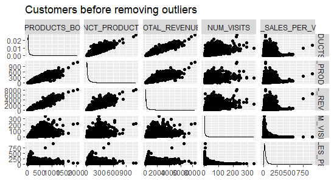
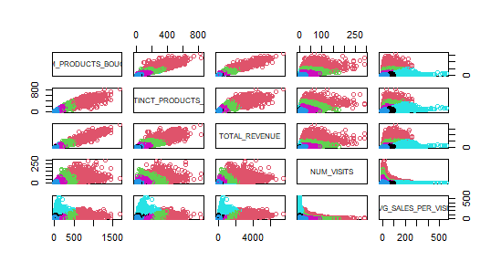

# Clustering and data processing in R
# **Table of contents**

[**Objective**](#_toc157806843)

[**About the data**](#_toc157806844)

[**Design/Methodology/Approach**](#_toc157806845)

[**Feature Selection, Feature Engineering and Feature Definition**](#_toc157806846)

[**Customers Features**](#_toc157806847)

[**Product Features**](#_toc157806848)

[**Data Cleansing**](#_toc157806849)

[**Outlier Removal**](#_toc157806850)

[**Cluster Analysis**](#_toc157806851)

[**Cluster Profiling**](#_toc157806852)

[**Customers Cluster Overview**](#_toc157806853)

[**Products Cluster Overview**](#_toc157806854)

[**Conclusion and Next Steps**](#_toc157806855)

**Executive Summary**

A comprehensive analysis of customers and their purchasing behaviour was performed using Sobey's Retail Data. The entire dataset of Sobeys was considered for the analysis, and it focused on grouping the customers and products based on various attributes such as their visits, revenues generated, the number of products bought etc. Through the cluster analysis with the help of K-means, the customers and products were grouped together based on their similar characteristics, hence making it easier to provide recommendation for future decisions.

Here is a brief overview of Customer Segmentation.

|**Customer**|**% of Customers**|**Description**|
| :- | :- | :- |
|Cluster 1: Minimalists|17\.52%|Customers with minimal product purchases, low revenue, low engagement resulting in average sales per visit.|
|Cluster 2: Power Shoppers|1\.76%|` `They are likely loyal customers.|
|Cluster 3: Regulars|7\.11%|They are part of a stable customer base with regular visits.|
|Cluster 4: Occasional Visitors|55\.51%|The customer with little engagement, which results in a low purchase frequency, revenue and sales per visit.|
|Cluster 5: Selective Buyers|3\.21%|Seldom Buys products, they've got the potential to increase their spending.|
|
Cluster 6: Moderate Spenders

|14\.89%|Moderation purchase activity which gives opportunity to increase spending|

Here is a brief overview of Product Segmentation.

|**Product**|**% of products**|**Description**|
| :- | :- | :- |
|Cluster 1: Niche Products|90%|Low customer base, revenue, and sales volume.|
|Cluster 2: Underperforming Products|7\.86%|Low revenue despite average sales volume.|
|Cluster 3: High Volume, Low Revenue Products|
0\.01%

|High sales volume with low revenue.|
|Cluster 4: Best-selling Products|0\.04%|Highest revenue and customer base.|
|Cluster 5: Potential Growth Products|0\.17%|Moderate revenue and sales volume.|
|
Cluster 6: Emerging Products:

|0\.95%|Moderate customer base and revenue.|

The findings after the segmentation of the customers and products provide necessary insights for the next and right business decision. Recommendations have been made according to the characteristics of each group, possibly resulting in increased revenue, loyal customer engagement, better marketing strategies and overall better management.
# **Objective**
The main objective of this analysis is to utilise Sobey’s data to naturally group their customers and products, wanting to understand their customers and their preferences. Being such a large retail chain, Sobeys undoubtedly understands the importance of knowing their customers, and commits to it [1]. By distributing the customers and products into insightful clusters with various steps such as data preparation, data cleaning, cluster analysis, K-means, recommendations, and predictions can be done to optimise marketing strategies, improve customer base and enhance customer satisfaction. This report aims to provide exactly that i.e a meaningful insight so that Sobeys improves business performance.
# **About the data**
The Sobey’s dataset consists of their sales, representing customer purchasing habits, item details, payment details. Details of the table used in this analysis is mentioned below:

**Sales Table**

This dataset provides insights into sales transactions, including details such as the items sold, quantities, prices, locations, and customer information.

We used this sales table to extract customer and products data.

*Number of records: 15,717,472*

*Reference Field: TRANSACTION\_RK*
# **Design/Methodology/Approach**
For companies looking to improve customer happiness and personalise their marketing campaigns, consumer segmentation is an essential tactic. For this aim, the RFM (Recency, Frequency, Monetary Value) model has been used extensively in the past. Nonetheless, we are aware that there is need for more in-depth research beyond RFM in our study, which uses Sobey's data.

Although the RFM model takes into account visit frequency, recent shopping history, and monetary value to provide insightful information about consumer behaviour, we think the dataset contains other dimensions that could lead to significant development prospects for the business. We have decided to add k-means clustering, a more comprehensive method, to the RFM model in order to optimise the value derived from the dataset.

K-means clustering provides an unsupervised, flexible way to group data points without requiring labelled data. It is perfect for identifying organic patterns and segments in the dataset because of its versatility. Our analytical approach is implemented in multiple pivotal phases:

1. **Data Extraction:** To start, a portion of the database's contents is extracted, with an emphasis on pertinent customer and product data.
1. **Data Segregation:** To enable targeted analysis, the extracted data is then divided into separate categories for customers and products.
1. **Feature Engineering:** Using feature engineering methods, we find and extract the best features that capture significant facets of both product and consumer behaviour.
1. **Outlier Removal:** We use data processing techniques to find and eliminate outliers that could distort results to assure the validity of our analysis.
1. **Data normalisation:** Using data points that have been standardised, results can be fairly compared and interpreted on various scales.
1. **Optimal Cluster Selection:** We ascertain the ideal number of clusters to be employed in the clustering procedure by applying the Elbow approach.
1. **Clustering Implementation:** In order to identify significant subgroups that can guide focused goals and endeavours, we lastly use the k-means clustering technique to classify both customers and products based on their shared qualities.

We hope to extract deeper insights from the dataset by using a more comprehensive analytical approach with k-means clustering. This will enable Sobey's to make well-informed decisions and achieve sustainable growth in the cutthroat industry.
# **Feature Selection, Feature Engineering and Feature Definition**
In the Sobey’s dataset, only those attributes were identified which would give meaningful insights during the analysis. The overall features selection, their engineering and definition is mentioned below for both products and customers:
## **Customers Features**

|**Feature Name**|**Measurement**|**Description**|
| :- | :- | :- |
|CUSTOMER\_SK|N/A|Unique Identifier for customer|
|NUM\_PRODUCTS\_BOUGHT|COUNT|Total products bought by a customer|
|NUM\_DISTINCT\_PRODUCTS\_BOUGHT|COUNT DISTINCT|Total number of distinct products bought by a customer. It can also be measured to know the variety of products bought by a customer|
|TOTAL\_REVENUE|SUM|Total amount generated through purchases of a customer|
|NUM\_VISITS|COUNT DISTINCT|Total number of visits a customer has made. It shows the frequency of visits|
|AVG\_SALES\_PER\_VISIT|SUM COUNT DISTINCT|Average sales generated by a customer each time they visit|

## **Product Features**

|**Feature Name**|**Measurement**|**Description**|
| :- | :- | :- |
|ITEM\_SK|N/A|Unique Identifier for customer|
|DISTNICT\_CUSTOMERS|
COUNT

DISTINCT
|Total number of distinct customers who bought the product|
|TOTAL\_REVENUE|SUM|Total revenue generated by that item|
|BASKETS|
COUNT

DISTINCT
|Total number of visits the product was bought in. For instance, a person can have multiple visits to the same store|
|AVERAGE\_QUANTITY\_SOLD|AVG|Average number of product quantity that has been sold|
#
**Data Cleansing and Outlier Removal**
## **Data Cleansing**
Data cleaning is the first and an essential part of any analysis. This technique aims to improve the accuracy and reliability of data, making it more usable for analysis [2]. A complete, right, and relevant data will give you the correct analysis. It involves identifying any inconsistencies, null or missing values, duplicates, and outliers. 

In the Sobey’s dataset, in the customer’s findings, 1 value was found to be extremely high than the remaining. This is necessary to remove since one value with extreme high or less would fluctuate the mean/median, making is difficult to give correct findings.

As you can see, the customer with CUSTOMER\_SK=1 has extremely high values, thus it was removed from the dataset. Since the value was so high, it was removed immediately, and we did not wait for the outliers to notice it.
## **Outlier Removal**
An outlier is a value or an observation that is distant from other observations [3]. Outlier removal is equally important since it helps to identify which extreme values is likely present that could fluctuate the analysis and affect the findings of the analysis. They necessarily don’t have to be bad data since it gives insights on high/low differences. But in regard to Sobey’s dataset, all the outliers seen were removed since only the relevant and related data were to be clustered.

Statistical methods such as boxplots and ggpairs were used to identify the outliers in the Sobeys dataset. Box plot is a valuable tool to compare multi-dimensional datasets and to identify the extremities between the values. Before performing k-means on the dataset, boxplots for each feature on both products and customers were plotted to feel the presence of outliers. The images below will make it clear on the outliers in the dataset used.

The scatterplots generated by ggpairs() is one of the easily understood graphs. Hence, in the analysis, the data is plotted to vizualize any possible outliers as they are separate from the general trends. They may either not follow the pattern or are at a distance from other data points.

**Customer Outliers**

- **Customer Boxplot (Before outlier removal)**

For the customer cluster there were few outliers that were removed.

1. High Num\_Product\_Bought Values

   The values removed were Customer\_SK belonging to 60279660.

1. High Num\_Distinct\_Product\_Values

   The values removed were Customer\_SK belonging to 64593270,52236223.

1. High Average\_sales\_per\_visit values

   The values removed were Customer\_SK belonging to 59505019,37448503 

1. Difference in the values of Num\_Of\_Visits

   The values removed were Customer\_SK belonging to 61361186  

- **Customer Boxplot (After outlier removal)**

**Product Outliers**

Product Boxplot (Before outlier removal)

|||
| :- | :- |
|||

For the Product cluster there were few outliers that were removed.

1. ITEM\_SK=11740941 (high num of visits) - the item is banana - cheap and most common, almost everyone buys it lol - adding it will scatter other data points

Here is the box plot for the outlier. 

1. ITEM\_SK=11612777 (Highest Avg Qty Sold) - the item is inhouse baked cookie - instore baked cookies are a specialty and popular product in the store
1. ITEM\_SK=11743100 (Highest Avg Qty Sold) - the item is chicken sandwich, which is common at any store and many people tend to buy it

There were a few more outliers in Avg Qty Sold that we very far from other data points but very close to themselves forming a cluster of themselves. Removing them as an outlier did would not have been a good approach.

**Product Boxplot (After outlier removal)**

|||
| :- | :- |
|||

# **Cluster Analysis**
The backbone of this analysis is k-means clustering algorithm which is used to separate customers and products into distinct groups based on their related characteristics. K-means distributes data points to clusters in such a way that the total of the squared distance between the data points and the cluster's centroid (the arithmetic mean of all the data points in that cluster) is the smallest [3]. K-means is widely used for its simplicity, and ability to handle large datasets. There are multiple ways to identify the number of clusters needed for the k-means analysis, the one used in the analysis of Sobey’s is elbow method.

In elbow method, a point is deduced where decrease of within-cluster sum of squares is slowed down, so much so that the next point would produce a result like the previous one. For the analysis of the dataset, several clusters were run to pinpoint the sum of each cluster.

The elbow method below is the result of 6th data point after which, the decrease of curve started slowing down. After looking at the result of the elbow curve method, 6 was decided to be the right number of clusters for both analysis of customer and product.

Elbow Curve method with 6 clusters for Customers

Elbow Curve method with 6 clusters for Products

# **Cluster Profiling**
Cluster Profiling deals with interpreting the behaviour of each cluster. Since 6 clusters has been decided, the data will be divided into each cluster based on their characteristics each having their own cluster membership number.

The features that were decided during the feature selection process will be now used to analyse each cluster. There are many ways to analyse the cluster, centroid analysis, feature analysis, membership analysis, cluster size and data distribution. To make things simple and easier, a graph has been plotted showing the behaviour of each cluster against each feature.
## **Customers Cluster Overview**
After the clusters has been decided and unscaled to deformalize data, the clusters are bonded together. It makes plotting of graph easy, and the visual representation explains the details well.

**Customer Cluster Summary**

The bar graph plotted clearly shows the distinction of features in each cluster. This makes segmentation of customer even easier. Based on the visual interpretation, there are recommendations catered towards each cluster mentioned in the table. The unique attribute of each cluster is described, along with proving insights into the kind of customers present in the dataset and the recommendations based on the individual characteristics for the future decisions are clearly mentioned in the table.

|**Customer Segmentation**|**Description**|**Recommendation**|
| :- | :- | :- |
|Cluster 1: Minimalists|Minimal product purchases, low revenue, low engagement resulting in average sales per visit|Prioritise targeting of marketing and promotion in order to increase customer engagement.|
|Cluster 2: Big Spender|Customers with significant purchase, concluding in high revenue, frequent visits and moderate sales per visit. They are likely the loyal customers.|They are already loyal customer. Continue to monitor. |
|Cluster 3: Regulars|Consumers who make moderate product purchases, generating medium revenue and modest sales on a per visit basis. They are part of a stable customer base with regular visits.|Provide personalised offers that are adapted to their preferences and some loyalty programmes for repeated purchases, in order to encourage continued loyalty.|
|Cluster 4: Occasional Visitors|The customer with little engagement, resulting in a low purchase frequency, revenue and sales per visit. Strategies to increase interactions and conversions are needed.|Re-engage the customers by targeted advertisement, special offers, discount and aim to enhance the shopping experience.|
|Cluster 5: Selective Buyers|Customers who seldom purchase products, which generates low revenue despite the fact that they are buying a limited range of products. They've got the potential to increase their spending.|Targeted personalised promotions and product recommendations are intended to boost buying behaviour.|
|
Cluster 6: Moderate Spenders

|Customers with moderate purchase activity, resulting in average revenue generation and visit frequency, but low sales per visit. It offers an opportunity to increase spending.|To encourage higher purchase values and increase sales per visit, offer incentives such as discounts or rewards.|
##

## **Products Cluster Overview**
After the product clusters has been decided and unscaled to deformalize data, the clusters are bonded together. It makes plotting of graph easy, and the visual representation explain the details well.

**Product Cluster Summary**

**

|Product Segmentation|Description|Recommendation|
| :- | :- | :- |
|Cluster 1: Niche Products|Products in this category have the fewest unique consumers, revenue, baskets, and average quantity sold.|Consider changing or stopping the marketing plan for these products. Investigate specialised advertising or niche markets to expand your reach and draw in additional customers.|
|Cluster 2: Underperforming Products|Products in this segment have low distinct customers, revenue, baskets, but average quantity sold.|Products in this category have medium amount sold but low revenue, baskets, and unique customers.|
|Cluster 3: High Volume, Low Revenue Products|This segment includes products with low distinct customers and revenue, but high average quantity sold.|Products with low revenue and number of different customers but high average amount sold are included in this segment.|
|Cluster 4: Best-selling Products|This segment's products have the highest average quantity sold, revenue, baskets, and number of unique consumers.|Pay attention to keeping these products accessible and of high quality. Use targeted marketing campaigns or loyalty programmes to draw in new customers while retaining current ones.|
|Cluster 5: Potential Growth Products|Products with moderately distinct customers, revenue, baskets, and average quantity sold are included in this segment.|Look for ways to boost revenue and sales even more. Launch marketing initiatives or sales campaigns to draw in new customers and raise the awareness of your products.|
|
Cluster 6: Emerging Products

|Products in this category have a moderate amount of income, baskets, average quantity sold, and unique customers.|Keep a watchful eye on these products' performance. To take use of their potential and promote additional growth, spend money on targeted marketing or promotional initiatives.|

# **Conclusion and Next Steps**
For this project, we used the retail dataset and clustering analysis to learn more about the behaviour of customers and products. Based on income, visits, number of products purchased, number of distinct products purchased, and average sales per visit, we grouped our customer base. Like this, we grouped products according to average quantity sold, number of unique customers purchasing the product, revenues, and number of visits during which the product is purchased.

1. **Customer Clustering**
   1. Based on their purchase patterns and other characteristics, we were able to identify several customer categories.
   1. Various customer profiles, including big spenders, repeat customers, and those who buy a wide range of goods, were identified by the clustering.
   1. During the analysis, outliers were found, and the necessary data cleaning techniques were used to guarantee the accuracy of the findings.

1. **Product Clustering**
   1. Products were categorised into groups according to customer popularity, revenue, and frequency of purchase.
   1. This study assisted in identifying products that are in high demand, specialised goods, and goods that may be up- or cross-marketed.

Next Steps:

1. **Refinement of Clusters:** To maximise cluster quality, more cluster refinement can be achieved by experimenting with various techniques and settings.
1. **Strategy for Customer Segmentation:** Create specialised marketing plans with an emphasis on product suggestions, loyalty schemes, and customised promotions for every identified consumer segment.
1. **Product Management:** To efficiently fulfil consumer demand, maximise inventory management, price strategies, and product selection by leveraging data from product clusters.
1. **Continuous Monitoring:** To adjust to shifting consumer preferences and market dynamics, put in place a system for continuously monitoring customer and product clusters.
1. **Integration with Business Operations:** To promote company expansion and raise customer satisfaction, incorporate the findings of cluster analysis into the decision-making procedures of many departments, such as marketing, sales, and operations.

All things considered, the clustering analysis offers insightful information on customer behaviour and product performance, empowering the company to make wise judgements and efficiently customise tactics to satisfy the demands of various customer segments.
## Appendix-1 [References]
1. Sobey's. (2023). Sobey's Corporate Overview [Brochure]. Sobey's.
1. Unimrkt, [08/05/2023], ‘The importance of data cleaning’, viewed [01/02/2024],<https://www.unimrkt.com/blog/the-importance-of-data-cleaning.php>
1. StatsAndR, 'Outliers Detection in R', StatsAndR, [02/02/2024],<https://statsandr.com/blog/outliers-detection-in-r/>.
1. Dabbura, [17/09/2017], 'K-Means Clustering Algorithm: Applications, Evaluation Methods, and Drawbacks', Towards Data Science, viewed [insert the date you accessed the website],<https://towardsdatascience.com/k-means-clustering-algorithm-applications-evaluation-methods-and-drawbacks-aa03e644b48a>.